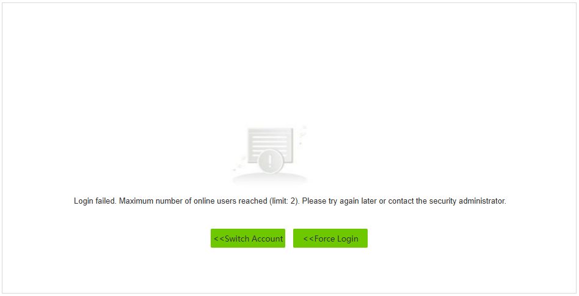
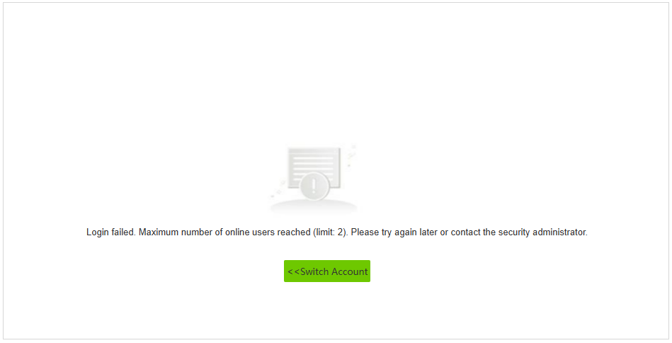
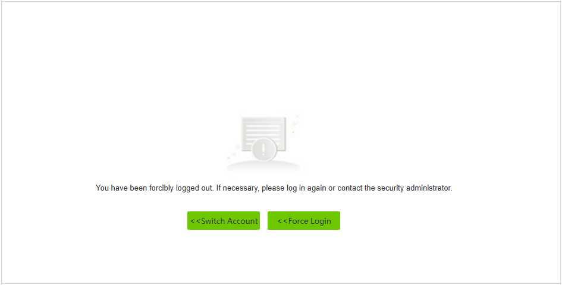
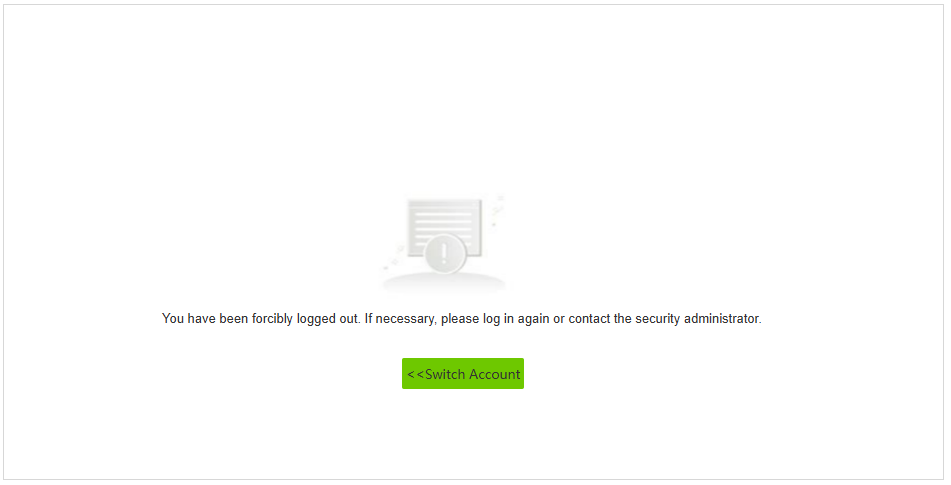

# Product License

## Trial Version Instructions

After installation, VC Hub offers a 30-day free trial. During the trial period, all functions of the product can be used.

You can activate the product by purchasing a formal license. Currently, only online activation is supported.

## Product Authorization Explanation

VC Hub supports both **annual subscription** and **one-time purchase**. Users can only choose one of these methods for purchase.

Authorization can be granted based on the following several function modules:

#### I/O Tag

There are 6 different license quantities available. You can determine the number of licenses to purchase based on your specific situation.

- 1,000 I/O tags 
- 2,000 I/O tags
- 5,000 I/O tags
- 10,000 I/O tags
- 20,000 I/O tags
- 50,000 I/O tags

**Notes:**

1. The tag numbers cannot be added together. For example: If you need to use 3,000 I/O tags, based on the number of tags, you need to purchase a license with ≥ 3000 tags.So you need to purchase a license that supports 5,000 I/O tags. 
2. If the I/O tag license is not activated, the quality of the I/O tag will be displayed as "Bad_NotLicensed".
3. If the number of created I/O tags exceeds the maximum allowed by the I/O tag license, then according to the tag sorting rules, the tags beyond the maximum limit will have their quality set to "Bad_NotLicensed".
4. Tags with a quality status of "Bad_NotLicensed" will no longer be collected or pushed in the preview and runtime pages.

#### Concurrent Online User

 The concurrent user count including 3 different types of data. 

- 2 Concurrent Online Users
- 5 Concurrent Online Users
- 10 Concurrent Online Users

**When the online count reaches the maximum limit, the user logs in**

- Users with Security Permission attempting to log in will be prompted with a login failure message. As shown in the figure below:

     - Click the "Switch" button to navigate to the login page. You can use another account or your current account to log in again. 
     - Clicking on "Force Login" will force a login and will also forcibly  log out the user who was online first.
- Users without Security Permission will be prompted with a login failure message. As shown in the following picture:
 
     - Click the "Switch" button to navigate to the login page. You can use another account or your current account to log in again. 

**When the user is forcibly logged out**

- When a user with Security Permission is forced to log out due to violating the rules, they will automatically be redirected to the following page:

     - Click the "Switch" button to navigate to the login page. You can use another account or your current account to log in again. 
     - Clicking on "Force Login" will force a login and will also forcibly log out the user who was online first.

- When a user without Security Permission is forcibly logged out, they will automatically be redirected to the following page:

     - Click the "Switch" button to navigate to the login page. You can use another account or your current account to log in again. 

**Notes:**

1. If the user does not purchase any Concurrent Online User type license, only one concurrent user is allowed.

2. The number of concurrent users is also not supported for accumulation.

#### Add On 

The following functional modules are Add Ons. 

- Database: MySQL,SQL Server,PostgreSQL,InfluxDB
- Report
- Alarm Notifications: SMS(Twilio),SMS(Ali Cloud),WeCom,DingTalk
- Open API
- Driver: MQTT Native,MQTT SparkplugB,WAGO Protocol
- 3D

**Notes:**

1. Each Add-on module can be purchased separately.
2. For modules that have not been licensed, display a message at the top of the page indicating that the corresponding module does not have a license, for example:
    
    
3. For unlicensed functional modules, normal operations (such as create, delete, update, and query) are allowed in the **Admin Console** and **Designer** pages, but functionality is restricted on the Preview and Runtime pages.

